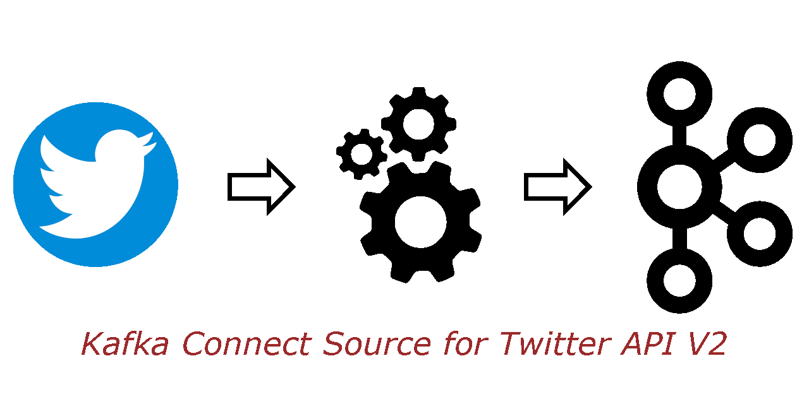

# kafka-connect-twitter-api-v2

<a name="readme-top"></a>

[![Contributors][contributors-shield]][contributors-url]
[![Forks][forks-shield]][forks-url]
[![Stargazers][stars-shield]][stars-url]
[![Issues][issues-shield]][issues-url]
[![MIT License][license-shield]][license-url]
[![LinkedIn][linkedin-shield]][linkedin-url]

<!-- PROJECT LOGO -->
<br />
<div align="center">
  <a href="https://github.com/adam-crowther/kafka-connect-twitter-api-v2">
    
  </a>

  <p align="center">
    A Kafka source connector implementation which streams Tweets to a Kafka Topic, using Twitter's API V2. 
    <br />
  </p>
</div>

<!-- ABOUT THE PROJECT -->

## About The Project

This connector was implemented for use with the Udemy
course [Apache Kafka Series - Kafka Connect Hands-on
Learning](https://www.udemy.com/course/kafka-connect/), which is given
by [Stephane Maarek](https://github.com/simplesteph).

This is a green-field implementation from scratch, inspired
by [kafka-connect-twitter](https://github.com/jcustenborder/kafka-connect-twitter)
by [Jeremy Custenborder](https://github.com/jcustenborder), which runs on the original Twitter API
V1, and the PR on that project by [Arek Burdach](https://github.com/arkadius), which is
here: https://github.com/jcustenborder/kafka-connect-twitter/pull/35. The V1 API now requires
"Elevated" access, which unfortunately renders Jeremy's connector obsolete.

If you use and like the connector, please consider giving this project a star :smile:.

### Built With

[![Kafka-Connect][Kafka-Connect-shield]][Kafka-Connect-url]
[![Twitter API][Twitter-API-shield]][Twitter-API-url]
[![Lombok][Lombok-shield]][Lombok-url]
[![Mapstruct][Mapstruct-shield]][Mapstruct-url]
[![Google Guava][Google-Guava-shield]][Google-Guava-url]
[![Slf4j][Slf4j-shield]][Slf4j-url]

#### Tested with

[![JUnit][JUnit-shield]][JUnit-url]
[![Mockito][Mockito-shield]][Mockito-url]
[![Hamcrest][Hamcrest-shield]][Hamcrest-url]
[![Awaitility][Awaitility-shield]][Awaitility-url]

<p align="right">(<a href="#readme-top">back to top</a>)</p>


<!-- GETTING STARTED -->

## Getting Started

### Prerequisites

This was implemented on a Windows 10 machine, with Git Bash Docker installed. The code is Java 11.

The scripts are run in Git Bash.

You will need an account on
the [Twitter Developer Portal](https://developer.twitter.com/en/portal/dashboard). [Sign up here](https://developer.twitter.com/en/docs/twitter-api/getting-started/getting-access-to-the-twitter-api),
which should give you a "bearer token" for authentication.

### Installation

1. Clone the repo
   ```sh
   git clone https://github.com/adam.crowther/kafka-connect-twitter-api-v2.git
   ```
2. Update the
   file [TwitterApiV2ConnectorSource.properties](config%2FTwitterApiV2ConnectorSource.properties)
   with your Twitter bearer token and any other changes you need:
   ```properties
   name=TwitterV2SourceConnector
   tasks.max=1
   connector.class=com.acroteq.kafka.connect.source.TwitterV2SourceConnector
   twitter.bearerToken=<REDACTED>
   twitter.filterKeywords=java,javascript,typescript,scala,python,ruby,kafka,docker,kubernetes,springboot
   twitter.tweetFields=id,text,author_id,created_at,conversation_id,lang,source
   twitter.retries=10
   kafka.tweetsTopic=twitter-tweets
   kafka.batch.maxsize=10
   kafka.batch.maxIntervalMs=1000
   errors.log.include.messages=true
   errors.log.enable=true
   ```
3. Build (gradle build, docker build)
   ```sh
   ./bin/build.sh
   ```
4. Open a shell and start Kafka
   ```sh
   docker-compose up zookeeper kafka
   ```
5. Start up a connector container running the bash command line (cli)
   ```sh
   ./bin/cli.sh   
   ```
   In the connector container, create your topic and then start a consumer
   ```sh
   kafka-topics.sh --bootstrap-server kafka:9092 --create --topic twitter-tweets --partitions 3 --replication-factor 1
   kafka-console-consumer.sh --bootstrap-server kafka:9092 --topic twitter-tweets
   ```
6. Open another shell and start the connector in standalone mode
   ```sh
   ./bin/run.sh
   ```

You should see Tweets start streaming in to your topic.

<p align="right">(<a href="#readme-top">back to top</a>)</p>


<!-- CONFIGURATION -->

## Configuration

| Name                      | Description                                                                                                                                | Type    | Default        | Example                                                                                  | Importance |
|---------------------------|--------------------------------------------------------------------------------------------------------------------------------------------|---------|----------------|------------------------------------------------------------------------------------------|------------|
| twitter.bearerToken       | Twitter bearer token.  A long, cryptic string.                                                                                             | string  |                |                                                                                          | high       |
| twitter.filterKeywords    | Comma delimited list of Twitter keywords to filter for. The twitter API active filter will be creates with the keywords in the same order. | list    |                | java, javascript, typescript, scala, python, ruby, kafka, docker, kubernetes, springboot | high       |
| twitter.tweetFields       | Comma delimited list of fields that will be returned. The order does not matter.                                                           | list    |                | id, text, author_id, created_at, conversation_id, lang, source                           | high       |
| twitter.retries           | The number of times to retry when the Twitter API call fails.                                                                              | integer | 10             |                                                                                          | low        |
| kafka.tweetsTopic         | Kafka topic for output.                                                                                                                    | string  | twitter-tweets |                                                                                          | low        |
| kafka.batch.maxsize       | The maximum number of records to return in a single batch.                                                                                 | integer | 100            |                                                                                          | low        |
| kafka.batch.maxIntervalMs | The maximum interval in milliseconds between batches, if the maximum batch size was not yet reached.                                       | integer | 1000           |                                                                                          | low        |

The Tweet source task publishes to the topic in batches

- if more than `kafka.batch.maxsize` tweets are received then the batch is published before
  the `kafka.batch.maxIntervalMs` elapses.
- if less than `kafka.batch.maxsize` tweets are received before the `kafka.batch.maxIntervalMs`
  elapses, then the batch is published with fewer tweets.

See
the [Twitter API data-dictionary object-model](https://developer.twitter.com/en/docs/twitter-api/data-dictionary/object-model/tweet)
for the list of available fields.

<p align="right">(<a href="#readme-top">back to top</a>)</p>


<!-- CONTRIBUTING -->

## Contributing

Any contributions are appreciated - feel free. Please fork the repo and create a pull
request. You can also simply open an issue with the tag "enhancement".

<p align="right">(<a href="#readme-top">back to top</a>)</p>


<!-- LICENSE -->

## License

Distributed under the [Unlicense](https://unlicense.org/). See `LICENSE.txt` for more information.

<p align="right">(<a href="#readme-top">back to top</a>)</p>


<!-- CONTACT -->

## Contact

Adam Crowther - [@adamcc_ch](https://twitter.com/adamcc_ch) - github@adamcc.ch

- LinkedIn: https://www.linkedin.com/in/adam-crowther-5a51564/
- Freelance.de: https://www.freelance.de/Freiberufler/246224-Tech-Lead-Software-Engineer
- Project
  Link: [https://github.com/adam.crowther/kafka-connect-twitter-api-v2](https://github.com/adam.crowther/kafka-connect-twitter-api-v2)

<p align="right">(<a href="#readme-top">back to top</a>)</p>


<!-- ACKNOWLEDGMENTS -->

## Acknowledgments

* This connector was implemented for use with the Udemy
  course [Apache Kafka Series - Kafka Connect Hands-on
  Learning](https://www.udemy.com/course/kafka-connect/), which is given
  by [Stephane Maarek](https://github.com/simplesteph).
* Inspired by [kafka-connect-twitter](https://github.com/jcustenborder/kafka-connect-twitter)
  by [Jeremy Custenborder](https://github.com/jcustenborder), which runs on the original Twitter API
  V1.
* And the PR on that project by [Arek Burdach](https://github.com/arkadius), which is
  here: https://github.com/jcustenborder/kafka-connect-twitter/pull/35.

<p align="right">(<a href="#readme-top">back to top</a>)</p>


<!-- MARKDOWN LINKS & IMAGES -->
<!-- https://www.markdownguide.org/basic-syntax/#reference-style-links -->

[contributors-shield]: https://img.shields.io/github/contributors/adam.crowther/kafka-connect-twitter-api-v2.svg?style=for-the-badge

[contributors-url]: https://github.com/adam.crowther/kafka-connect-twitter-api-v2/graphs/contributors

[forks-shield]: https://img.shields.io/github/forks/adam.crowther/kafka-connect-twitter-api-v2.svg?style=for-the-badge

[forks-url]: https://github.com/adam.crowther/kafka-connect-twitter-api-v2/network/members

[stars-shield]: https://img.shields.io/github/stars/adam.crowther/kafka-connect-twitter-api-v2.svg?style=for-the-badge

[stars-url]: https://github.com/adam.crowther/kafka-connect-twitter-api-v2/stargazers

[issues-shield]: https://img.shields.io/github/issues/adam.crowther/kafka-connect-twitter-api-v2.svg?style=for-the-badge

[issues-url]: https://github.com/adam.crowther/kafka-connect-twitter-api-v2/issues

[license-shield]: https://img.shields.io/github/license/adam.crowther/kafka-connect-twitter-api-v2.svg?style=for-the-badge

[license-url]: https://github.com/adam.crowther/kafka-connect-twitter-api-v2/blob/master/LICENSE.txt

[linkedin-shield]: https://img.shields.io/badge/-LinkedIn-black.svg?style=for-the-badge&logo=linkedin&colorB=555

[linkedin-url]: https://www.linkedin.com/in/adam-crowther-5a51564/

[product-screenshot]: images/screenshot.png

[Mapstruct-shield]: https://img.shields.io/badge/Mapstruct-e94e1b?style=for-the-badge

[Mapstruct-url]: https://mapstruct.org/

[Lombok-shield]: https://img.shields.io/badge/Lombok-626980?style=for-the-badge

[Lombok-url]: https://projectlombok.org/

[Slf4j-shield]: https://img.shields.io/badge/Slf4j-ffd0a0?style=for-the-badge

[Slf4j-url]: https://www.slf4j.org/

[Kafka-Connect-shield]: https://img.shields.io/badge/Kafka%20Connect-000000?style=for-the-badge

[Kafka-Connect-url]: https://kafka.apache.org/documentation/#connectapi

[Google-Guava-shield]: https://img.shields.io/badge/Google%20Guava-8fc43e?style=for-the-badge

[Google-Guava-url]: https://github.com/google/guava

[Twitter-API-shield]: https://img.shields.io/badge/Twitter%20API%20V2-1d9bf0?style=for-the-badge

[Twitter-API-url]: https://developer.twitter.com/en/docs/twitter-api

[JUnit-shield]: https://img.shields.io/badge/JUnit-2d5fd2?style=for-the-badge

[JUnit-url]: https://junit.org/junit5/

[Mockito-shield]: https://img.shields.io/badge/Mockito-78a540?style=for-the-badge

[Mockito-url]: https://site.mockito.org/

[Hamcrest-shield]: https://img.shields.io/badge/Hamcrest-b07219?style=for-the-badge

[Hamcrest-url]: https://hamcrest.org/

[Awaitility-shield]: https://img.shields.io/badge/Awaitility-a40000?style=for-the-badge

[Awaitility-url]: http://www.awaitility.org/
